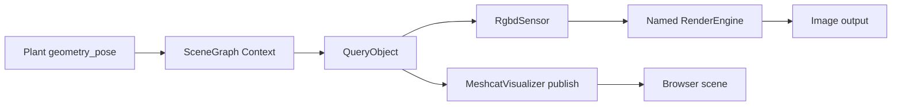

# E4：相机、图像与渲染的原生数据路径

[Sim Atlas 学习首页](https://github.com/huangkiki/sim-atlas) · [课程](curriculum.md) · [采样与延迟](sensor-timing.md) · [惯性与力传感](inertial-force-sensing.md)

先修 [E1 坐标与对象](modeling-state-time.md)和[状态与时间](state-time.md)。本篇完成 A6 的几何、RGB-D、label、点云及显示部分；固定阅读 Drake v1.57.0 提交 `1e1466ba466e7ce8fa9fcca4e086ce1383e5427d`。全部结论来自原生声明、实现和绑定，未启动渲染或浏览器，也不补充 DexLab 运行资格。

## 1. 一张图像经过哪些对象

`MultibodyPlant` 提供身体运动，`SceneGraph` 保存几何、各 role 的属性和 Context 中的位姿；`QueryObject` 是访问当前场景的查询入口；`RgbdSensor` 把相机参数和 QueryObject 变成系统输出；被命名的 `RenderEngine` 真正生成像素。相机可以观察只有锚定几何的 SceneGraph，不要求场景一定包含动力学 plant。

`RgbdSensor::CalcColorImage/CalcDepthImage32F/CalcLabelImage` 调用 QueryObject 的三个 Render 方法；QueryObject 先完成 pose/configuration 更新，GeometryState 再按 `renderer_name` 找 renderer，计算相机世界位姿、`UpdateViewpoint` 后渲染。这条链没有调用物理推进器。Eval 可能触发渲染工作，但不表示前进了一步仿真。[传感器实现](https://github.com/RobotLocomotion/drake/blob/1e1466ba466e7ce8fa9fcca4e086ce1383e5427d/systems/sensors/rgbd_sensor.cc#L235-L269)、[QueryObject](https://github.com/RobotLocomotion/drake/blob/1e1466ba466e7ce8fa9fcca4e086ce1383e5427d/geometry/query_object.cc#L243-L276)、[渲染分派](https://github.com/RobotLocomotion/drake/blob/1e1466ba466e7ce8fa9fcca4e086ce1383e5427d/geometry/geometry_state.cc#L1630-L1670)。

| 原生对象/API | 输入或配置 | 结果与边界 |
|---|---|---|
| `SceneGraph.AddRenderer(name, engine)` | 唯一名字、具体 renderer | Python 对应复制/clone 重载；`RenderCameraCore` 必须使用同名 renderer |
| `PerceptionProperties` / `AssignRole` | 几何的感知材质和 label | 相机渲染使用 perception；proximity 与 illustration 不能自动替代 |
| `CameraInfo` | 宽高、fx/fy/cx/cy 或垂直 FOV | 针孔内参，不包含世界位姿 |
| `RenderCameraCore` | renderer 名、内参、clipping、X_BS | S 是该 imager 的光学坐标，RGB 对应 C，深度对应 D |
| `ColorRenderCamera` | core、show_window | 同时供 RGB 和 label 使用 |
| `DepthRenderCamera` | core、DepthRange | 测量范围与 clipping 有不同职责 |
| `RgbdSensor` | parent FrameId、X_PB、两种 camera | 输出图像、X_WB、图像时标；本体是 `LeafSystem<double>` |

[Renderer 的模型/Context 重载](https://github.com/RobotLocomotion/drake/blob/1e1466ba466e7ce8fa9fcca4e086ce1383e5427d/geometry/scene_graph.h#L713-L740)、[perception role](https://github.com/RobotLocomotion/drake/blob/1e1466ba466e7ce8fa9fcca4e086ce1383e5427d/geometry/scene_graph.h#L915-L940)、[RenderCameraCore](https://github.com/RobotLocomotion/drake/blob/1e1466ba466e7ce8fa9fcca4e086ce1383e5427d/geometry/render/render_camera.h#L82-L120)、[RgbdSensor 构造](https://github.com/RobotLocomotion/drake/blob/1e1466ba466e7ce8fa9fcca4e086ce1383e5427d/systems/sensors/rgbd_sensor.h#L107-L126)。添加 renderer 后仍需给目标几何正确的 perception 属性；几何可通过 `(renderer, accepting)` 属性限制接收它的 renderer，不能仅凭“物体在 Meshcat 里可见”判定相机也能看到。

## 2. 光学坐标、内参和投影

约定 `X_AB` 将 B 中坐标映到 A。P 是父 SceneGraph frame，B 是相机外壳，C/D 分别是颜色和深度 imager：

$$
X_{WC}=X_{WP}X_{PB}X_{BC},\qquad X_{WD}=X_{WP}X_{PB}X_{BD}.
$$

C 和 D 都是 **x 向图像右、y 向图像下、z 沿视线向前**。`body_pose_in_world` 是 X_WB，只有 X_BD=I 时才可直接用作深度点云的 X_WD。RGB 与 label 共用 C 的配置以保证配准；RGB 与 depth 可以有不同外参、内参和尺寸。[frame 定义](https://github.com/RobotLocomotion/drake/blob/1e1466ba466e7ce8fa9fcca4e086ce1383e5427d/systems/sensors/rgbd_sensor.h#L56-L77)、[位姿输出](https://github.com/RobotLocomotion/drake/blob/1e1466ba466e7ce8fa9fcca4e086ce1383e5427d/systems/sensors/rgbd_sensor.cc#L271-L281)、[光学位姿组合](https://github.com/RobotLocomotion/drake/blob/1e1466ba466e7ce8fa9fcca4e086ce1383e5427d/geometry/geometry_state.cc#L2299-L2304)。

忽略畸变，对 z>0 的 `p_CQ=(x,y,z)`，

$$
u=f_x x/z+c_x,\quad v=f_y y/z+c_y,\quad
K=\begin{bmatrix}f_x&0&c_x\\0&f_y&c_y\\0&0&1\end{bmatrix}.
$$

fx、fy、cx、cy 的单位都是像素；x/y/z 为 m。图像左上第一个**像素中心**是 (u,v)=(0,0)。宽 W、高 H、垂直视场 θ 的构造器实际取 `fx=fy=(H/2)/tan(θ/2)`，`cx=(W−1)/2`，`cy=(H−1)/2`，不是 W/2、H/2。[投影约定](https://github.com/RobotLocomotion/drake/blob/1e1466ba466e7ce8fa9fcca4e086ce1383e5427d/systems/sensors/camera_info.h#L42-L86)、[像素中心](https://github.com/RobotLocomotion/drake/blob/1e1466ba466e7ce8fa9fcca4e086ce1383e5427d/systems/sensors/camera_info.h#L117-L123)、[构造实现](https://github.com/RobotLocomotion/drake/blob/1e1466ba466e7ce8fa9fcca4e086ce1383e5427d/systems/sensors/camera_info.cc#L46-L89)。

这种模型没有自动加入镜头畸变、曝光、运动模糊或 rolling shutter。要研究这些现象，先明确新增成像模型与时间合同；不能把普通 pinhole 深度图当作真实硬件全部误差的实现。

## 3. 图像形状、特殊值和所有权

构造图像时写 `(width,height)`，Python `.data` 却是 `(height,width,channels)`；像素 `image.at(u,v)` 对应 `.data[v,u,:]`。底层存储偏移是 `(u+v*width)*channels`。不要把单通道图像直接当作二维矩阵，显式选择 `[...,0]`。[C++ 图像索引](https://github.com/RobotLocomotion/drake/blob/1e1466ba466e7ce8fa9fcca4e086ce1383e5427d/systems/sensors/image.h#L120-L157)、[NumPy 绑定](https://github.com/RobotLocomotion/drake/blob/1e1466ba466e7ce8fa9fcca4e086ce1383e5427d/bindings/pydrake/systems/sensors_py_image.cc#L69-L112)。

| 输出端口 | 原生 Image / NumPy dtype | Python shape | 物理含义 |
|---|---|---|---|
| `color_image_output_port()` | `ImageRgba8U` / uint8 | Hc×Wc×4 | RGBA，不是 BGR；颜色和透明度通道无长度单位 |
| `depth_image_32F_output_port()` | `ImageDepth32F` / float32 | Hd×Wd×1 | D 中的 z，m；0 太近，+Inf 太远 |
| `depth_image_16U_output_port()` | `ImageDepth16U` / uint16 | Hd×Wd×1 | D 中的 z，mm；0 太近，65535 太远/超表示范围，最大有效 65534 mm |
| `label_image_output_port()` | `ImageLabel16I` / int16 | Hc×Wc×1 | 几何所带 RenderLabel，无单位；不是 GeometryId 的原始整数 |
| `body_pose_in_world_output_port()` | `RigidTransform` | 非图像 | X_WB：旋转无量纲、平移 m |
| `image_time_output_port()` | vector size 1 | (1,) | 秒；不同传感器类的采样语义见下一篇 |

[格式合同](https://github.com/RobotLocomotion/drake/blob/1e1466ba466e7ce8fa9fcca4e086ce1383e5427d/systems/sensors/rgbd_sensor.h#L79-L104)、[traits 常量](https://github.com/RobotLocomotion/drake/blob/1e1466ba466e7ce8fa9fcca4e086ce1383e5427d/systems/sensors/pixel_types.h#L117-L161)。32F→16U 实现乘 1000、饱和到 [0,65535] 后**向零截断**；NaN 和 +Inf 映成 65535，−Inf 映成 0，不能保持所有无效值类别。16U→32F 把 65535 恢复为 +Inf，其余乘 0.001。[转换实现](https://github.com/RobotLocomotion/drake/blob/1e1466ba466e7ce8fa9fcca4e086ce1383e5427d/systems/sensors/image.cc#L36-L63)。

`.data` 是引用 Image 存储的 NumPy 视图，不是每次分配的独立快照。输出 Eval 的 Image 也通常由系统缓存拥有。长期记录应在明确时刻取 `.data.copy()`，同时保存内外参、捕获时间、输出可用时间及单位；不要跨后续 Eval、resize 或 Context 修改保存一个视图并声称它是旧帧。初始零尺寸图像先检查 width/height，再访问像素。[绑定引用策略](https://github.com/RobotLocomotion/drake/blob/1e1466ba466e7ce8fa9fcca4e086ce1383e5427d/bindings/pydrake/systems/sensors_py_image.cc#L78-L112)、[resize](https://github.com/RobotLocomotion/drake/blob/1e1466ba466e7ce8fa9fcca4e086ce1383e5427d/systems/sensors/image.h#L125-L131)。

## 4. z-depth、射线距离和点云

深度 z 不是沿像素射线的欧氏距离 r。无畸变、合法有限 z 时：

$$
p_{DQ}=z[(u-c_x)/f_x,(v-c_y)/f_y,1]^T,\qquad
r=z\sqrt{1+((u-c_x)/f_x)^2+((v-c_y)/f_y)^2}.
$$

例如 fx=fy=100，主点 (50,40)，像素 (150,40) 的 z=2 m，对应 (2,0,2) m，射程为 2√2 m。该解析例子只检验单位和投影，未生成任何图像。

`DepthImageToPointCloud` 实现正是逐像素按上式反投影，并可乘输入的 X_PD 输出 P 中坐标。默认 depth 类型 32F、scale=1；16U 的毫米输入必须显式 `scale=0.001` 才能得到米。它不自动做 RGB/depth 配准，传入 color 必须已经在同一 frame/像素网格；点云列序为 `v*width+u`，XYZ 输出 float32。太近/太远转换为三维 +Inf；NaN 转为 NaN，并未删除这些点。[接口与 scale](https://github.com/RobotLocomotion/drake/blob/1e1466ba466e7ce8fa9fcca4e086ce1383e5427d/perception/depth_image_to_point_cloud.h#L20-L65)、[反投影实现](https://github.com/RobotLocomotion/drake/blob/1e1466ba466e7ce8fa9fcca4e086ce1383e5427d/perception/depth_image_to_point_cloud.cc#L59-L97)。

固定官方 tree 中未发现以 `lidar`、`depth_sensor`、`raycast` 或 `ray_cast` 命名的实现文件，也未将历史 `DepthSensor` 注释当作当前可用 API。当前这条原生深度路径是 renderer 生成的相机 z-depth；距离/碰撞查询属于另一类几何 API。本课没有宣称实现扫描式 LiDAR、扫描时序、射线多回波、强度或飞行时间噪声。需要这些时应明确适配器/外部传感器模型与原生功能边界，不能只改图像名称。

## 5. clipping 与有效测距范围

`ClippingRange(near,far)` 决定 renderer 的可见视体，`DepthRange(min,max)` 决定测距输出的有效区间；后者必须包含在前者内。若物体位于 near 与 min 之间，它仍应遮挡远方物体并产生“太近”。把 near=min 会直接裁掉它，可能让相机看穿近处遮挡。[深度与 clipping 的区别](https://github.com/RobotLocomotion/drake/blob/1e1466ba466e7ce8fa9fcca4e086ce1383e5427d/geometry/render/render_camera.h#L165-L210)。

例如 clipping=[0.01,10] m，depth=[0.1,5] m；0.05 m 的物体是太近遮挡，而不是透明。也不应把 far 设得任意巨大：固定精度 z-buffer 在过大范围内会损失深度区分能力，产生 z-fighting。[裁剪精度](https://github.com/RobotLocomotion/drake/blob/1e1466ba466e7ce8fa9fcca4e086ce1383e5427d/geometry/render/render_camera.h#L28-L64)。这不是接触 penetration 容差，也不是 plant 的碰撞距离阈值。

## 6. label 是应用定义的语义

每个 perception geometry 可带 `(label,id): RenderLabel(n)`。多个几何可以共享 n 表示同一类别，也可以逐几何分配做 instance mask；Drake 不会推断“这个 id 是杯子”。必须保存 label→类别/实例的映射，不能假设稳定跨资产导入顺序。[RenderLabel 合同](https://github.com/RobotLocomotion/drake/blob/1e1466ba466e7ce8fa9fcca4e086ce1383e5427d/geometry/render/render_label.h#L16-L68)。

| 保留 label | 含义 | 易混淆点 |
|---|---|---|
| `kEmpty` | 没有几何渲染到该像素 | 不应当作普通物体 label 分配 |
| `kDoNotRender` | 该几何不参与 label 图像 | 后方物体可出现在 label 中，不等于把 RGB 几何删除 |
| `kDontCare` | 仍参与 label 渲染，但类别不关心 | 仍可遮挡后方物体 |
| `kUnspecified` | 未明确指定 | renderer 默认策略可能拒绝注册，不是自动背景类别 |

[保留值](https://github.com/RobotLocomotion/drake/blob/1e1466ba466e7ce8fa9fcca4e086ce1383e5427d/geometry/render/render_label.h#L29-L64)、[renderer 默认 label 与注册规则](https://github.com/RobotLocomotion/drake/blob/1e1466ba466e7ce8fa9fcca4e086ce1383e5427d/geometry/render/render_engine.h#L54-L83)。显示 label 的伪彩色图仅供人查看，原始监督信号应保留 int16 id；不能对伪彩色 RGB 值自行反推统一语义类别。

## 7. Meshcat 与 headless

Meshcat 是 HTTP/WebSocket 服务加浏览器场景；`MeshcatVisualizer` 是订阅 QueryObject 的 **publish 系统**，不输出 RgbdSensor 的 depth/label 图像。默认 role=illustration、发布周期 1/64 s、prefix=`visualizer`，初始化可删除该 prefix。显示碰撞几何需选择 proximity；显示 hydroelastic 网格还需 `show_hydroelastic=True`。[默认参数](https://github.com/RobotLocomotion/drake/blob/1e1466ba466e7ce8fa9fcca4e086ce1383e5427d/geometry/meshcat_visualizer_params.h#L30-L83)、[周期/强制/初始化事件](https://github.com/RobotLocomotion/drake/blob/1e1466ba466e7ce8fa9fcca4e086ce1383e5427d/geometry/meshcat_visualizer.cc#L24-L52)。

`MeshcatVisualizer.AddToBuilder` 连接查询端口；未来运行中 `diagram.ForcedPublish(root_context)` 可以发布当前场景，但不会推进 plant 或更新相机 ZOH。`StartRecording/StopRecording/PublishRecording` 记录并发送可视化动画，不是物理状态快照，更不是 RGB-D 传感器数据集。[录制实现](https://github.com/RobotLocomotion/drake/blob/1e1466ba466e7ce8fa9fcca4e086ce1383e5427d/geometry/meshcat_visualizer.cc#L74-L100)。`StaticHtml()` 可保存无需服务器的场景快照，但不包含依赖服务器的控制按钮/滑块。[HTML 导出](https://github.com/RobotLocomotion/drake/blob/1e1466ba466e7ce8fa9fcca4e086ce1383e5427d/geometry/meshcat.h#L950-L960)。

两个显示时钟也要分开：publish_period 是仿真时间事件间隔，浏览器收到消息与画出的帧受网络、队列和浏览器影响。`Flush()` 只等待缓冲消息发给已连接客户端，不承诺屏幕完成绘制。Meshcat 方法应从创建它的线程调用，MeshcatVisualizer 不支持 Context-per-thread 并行；克隆 Context 不会凭空克隆独立浏览器场景。[服务与线程](https://github.com/RobotLocomotion/drake/blob/1e1466ba466e7ce8fa9fcca4e086ce1383e5427d/geometry/meshcat.h#L34-L44)、[Flush](https://github.com/RobotLocomotion/drake/blob/1e1466ba466e7ce8fa9fcca4e086ce1383e5427d/geometry/meshcat.h#L171-L176)、[visualizer 并行限制](https://github.com/RobotLocomotion/drake/blob/1e1466ba466e7ce8fa9fcca4e086ce1383e5427d/geometry/meshcat_visualizer.h#L86-L91)。

| 需求 | 原生路径 | 实际环境边界 |
|---|---|---|
| 取得 RGB-D/label 数组 | RgbdSensor + 命名 RenderEngine | 不需要 Meshcat 浏览器；仍需要该 renderer 的图形依赖 |
| 浏览器交互看几何 | Meshcat + MeshcatVisualizer | 服务和浏览器有独立生命周期；不是相机光学渲染结果 |
| 无弹出窗口成像 | `show_window=False` + 可用 offscreen backend | false 只是窗口请求；不能证明图形驱动、EGL/GLX 或设备可用 |
| 异步渲染 | RgbdSensorAsync 的独立 worker | 本固定版主要面向外部 glTF renderer，详见时序篇 |

VTK 参数的 backend 可为 `""/"GLX"/"EGL"/"Cocoa"`；固定版本默认 Linux EGL、macOS Cocoa，EGL 不支持调试窗口。非法名称报错；平台不支持的选择可能警告后回落默认，不应只看配置字符串宣称实际 backend。[参数合同](https://github.com/RobotLocomotion/drake/blob/1e1466ba466e7ce8fa9fcca4e086ce1383e5427d/geometry/render_vtk/render_engine_vtk_params.h#L340-L360)、[选择实现](https://github.com/RobotLocomotion/drake/blob/1e1466ba466e7ce8fa9fcca4e086ce1383e5427d/geometry/render_vtk/render_engine_vtk_params.cc#L12-L53)。`CameraConfig` 支持 VTK、GL、glTF client 三类，类名/能力与本机实际 wheel、依赖和渲染设备仍需将来单独核验；本课不提供性能排名。[renderer 配置](https://github.com/RobotLocomotion/drake/blob/1e1466ba466e7ce8fa9fcca4e086ce1383e5427d/systems/sensors/camera_config.h#L330-L367)。

## 8. 阅读练习与答案

1. **相机 depth 有效而 Meshcat 什么也不显示，首先核对什么？** 答：两者的 role、连接和 prefix。相机用 perception，Meshcat 默认 illustration；显示失败不能推导物理几何缺失。
2. **深度图 shape=(480,640,1)，如何取 u=20,v=30 的 z？** 答：`.data[30,20,0]`；32F 是米，16U 是毫米并有哨兵值。
3. **相机 body 位置是 X_WB，深度 imager 在 B 中偏移 2 cm，点云可直接用 X_WB 吗？** 答：不能，应使用 X_WD=X_WB X_BD，且它要与图像同一捕获时刻。
4. **给定上一节投影例子，z=2 m 为什么不代表射程 2 m？** 答：该像素离光轴有角度，反投影是 (2,0,2)，射程 2√2 m；只有光轴上 r=z。
5. **16U 点云放大了 1000 倍，先查什么？** 答：DepthImageToPointCloud 的 scale 默认 1，应对毫米输入设 0.001，并先处理 0/65535。
6. **要忽略玻璃的 label 但看到后方实例，选哪个保留值？** 答：kDoNotRender；kDontCare 仍参加 label 成像。
7. **show_window=False、Flush 成功，能证明 headless 图像正确且浏览器已画完吗？** 答：两者都不能。前者是窗口选项，后者是消息发送边界；本轮没有实际图像或屏幕验收。

下一篇沿同一组对象讲[采样、延迟与 Context 所有权](sensor-timing.md)。来源身份、检查结果和未运行范围见 [E4 静态证据](evidence/e4-validation.md)。
